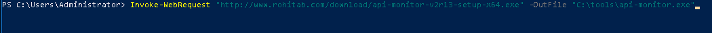
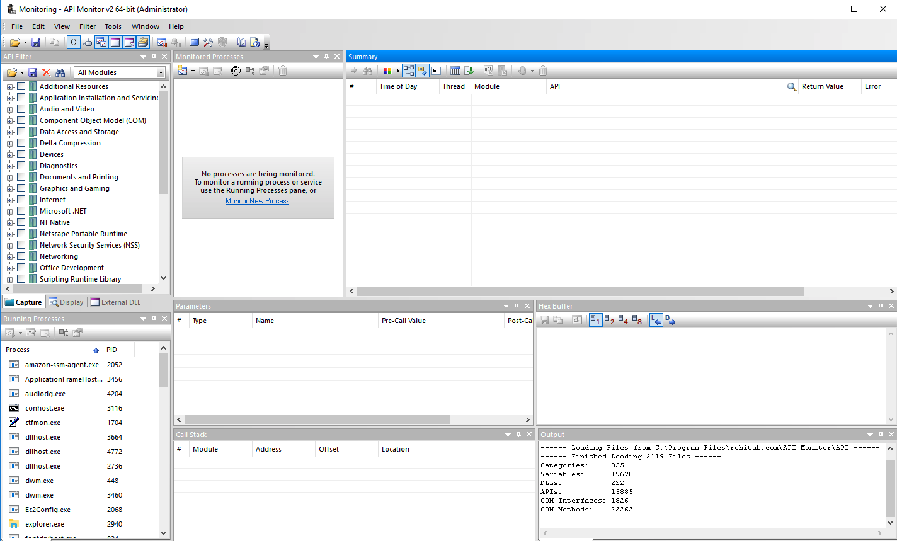
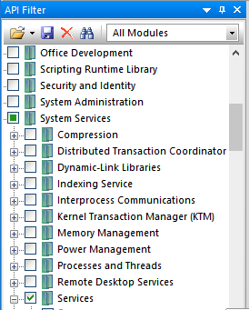
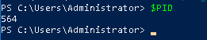
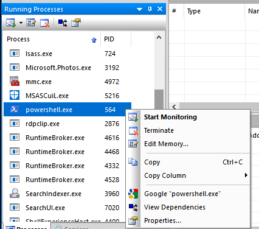
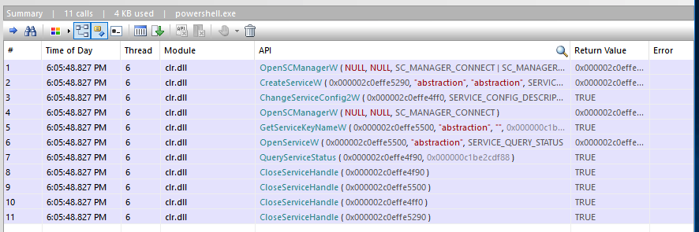

+++
title = "Engineer a Detection - API Monitor"
menuTitle = "Engineer a Detection - API Monitor"
chapter = false
weight = 1
pre = "<i class='fab fa-leanpub'></i> "
+++

## Description

We want to determine what API(s) are called when creating a service. To do this, we can dynamically analyze a process of choice and see what API(s) it calls to perform its action. In this lab we will walk through how to utilize a tool called "API Monitor" to see which API(s) are called when we use powershell.exe to create a service.

## Goals

### By the end of this lab, you should be able to

* Understand how to use API Monitor
* Understand how to perform dynamic analysis with API Monitor

{}
If this is not the case, please ask for help!
{}

## Requirements

- Access to the Windows 10 student system
- API Monitor

{}

---

## Steps

### Step 1: Install API Monitor

*  Click on the Windows Start Menu

*  In the search bar, type "powershell"

*  Right click on "Windows PowerShell" and select "Run as Administrator"

* Input: `Invoke-WebRequest "http://www.rohitab.com/download/api-monitor-v2r13-setup-x64.exe" -OutFile "C:\tools\api-monitor.exe"`

This will invoke a webrequest to download the API Monitor Setup executable and set the path as "C:\tools\api-monitor.exe"

* Run the setup script by running: `C:\tools\api-monitor.exe` in powershell. 

* Walk through the installation steps. 

### Step 2: Use API Monitor for Dynamic Analysis

* Go to the Start Menu, and search for API Monitor (64) and open it

* When prompted, press "Ok"

* Input the API(s) you want to monitor. For this exercise we will monitor API(s) that correlate directly to Services. To look for these API(s) go to "API Filter", expand "System Services", and check the "Services" box.

* Expand "Services" and take note of the API(s) being monitored for. 

* Get the Process ID of your powershell process by inputting: `$PID`

* Under "Running Processes" find your PID, then right click and press "Start Monitoring"

**Note**: Under "Monitoring Processes" you should now see that your powershell process is being monitored. 

* In your powershell window, input: `New-Service -Name abstraction -BinaryPathName C:\Windows\notepad.exe -DisplayName abstraction -StartupType Automatic`

* Go to API Monitor and look under "Summary" to see the API(s) called

## Questions

- What API(s) were called when creating a service?
- Did any API(s) fire you did not expect to see?
