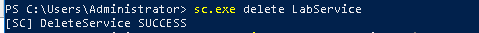
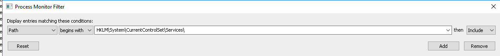
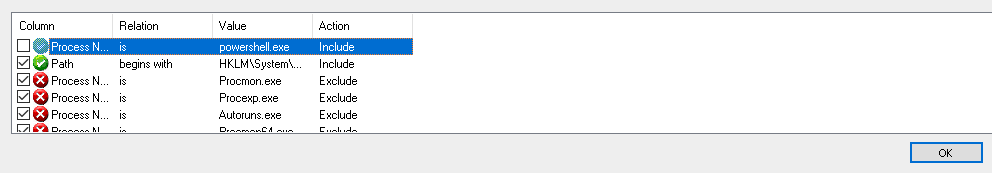
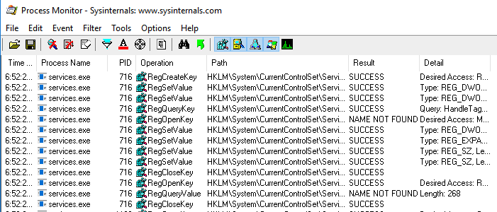

+++
title = "Engineer a Detection - Procmon"
menuTitle = "Engineer a Detection - Procmon"
chapter = false
weight = 306
pre = "<i class='fab fa-leanpub'></i> "
+++

## Description

Now that we have selected New Service as our technique, and used the detection guidance within MITRE ATT&CK to research common utilities. We have chosen to focus on PowerShell's New-Service cmdlet as one of the most common methods to install services. In this next step, we will monitor SC.EXE with Procmon to dynamically analyze how it creates a service, and continue filling out the abstraction map.

{}
Review previous labs for process similarities in order to accomplish the main objective(s)
{}

## Goals

### By the end of this lab, you should be able to

* Understand how to use Procmon
* Understand how to perform dynamic analysis with Procmon

{}
If this is not the case, please ask for help!
{}

## Requirements

- Access to the Windows 10 student system
- Sysinterals Procmon

{}

---

## Steps

## 1. Open Procmon: 

* Open File Explorer and navigate to `C:\tools\SysinteralsSuite`

* Right click on `Procmon64.exe` and click "Run as administrator"
* Click on "Agree" on the License Agreement

Procmon should be open and ready to use: 

## 2. Set up Procmon for dynamic analysis

Now that we have an example of a common method to install a service, we are going to use Procmon to dynamically analyze what happens when the `New-Service` powershell cmdlet creates a service.

Follow the steps below to set Procmon up:

*  With Procmon open, click on Filter

*  Click on Filter again

*  In the Filter popup, enter the following values as: `Process Name is powershell.exe`. See screenshot for reference. Once these values are added, click `Add`

*  Once the filter appears in the list, click Apply

*  Click on capture

Procmon is now configured to show us events for only `powershell.exe` activity on our system

## 2. Run example using Procmon

Now that Procmon is configured, we need to install a service using `powershell.exe`

To do this:

*  Open an Administrative PowerShell window
*  Run the following command:

`New-Service -Name LabService -BinaryPathName C:\Windows\System32\notepad.exe`

If the command completed successfully, you will see 

## 3. Analyze results

Now that our service has been created, we need to see what clues are contained in the Procmon data.

We can see in Procmon that there is an amount of activity, but reading through, we see no evidence of interaction with `HKEY_LOCAL_MACHINE\SYSTEM\CurrentControlSet\Services`. Why is this? 

We know that the Service Control Manager database is stored in the registry. Is powershell.exe the process creating the service? No. However, we don't know which process is so lets do some more analysis to find out. 

## 4. Re-analyzing Service Creation

*  In your powershell.exe prompt, input: `sc.exe delete LabService`. This will remove our test service we just created. 

*  In Procmon press the `Capture button` to stop capturing events. 

*  With Procmon open, click on Filter

*  Click on Filter again

*  In the Filter popup, enter the following values as: `Path begins with HKEY_LOCAL_MACHINE\SYSTEM\CurrentControlSet\Services\ `. Then click `Add`

*  We want to remove powershell.exe from the capture list, to do this uncheck its box on the left of its column within the filter listing. Your filter should now look like this: 

*  Once the filter is removed click `Apply`

*  Click on capture

*  Go back into your powershell window and run: `New-Service -Name LabService -BinaryPathName C:\Windows\System32\notepad.exe` to create our test service.

If the command completed successfully, you will see this: 

*  Go back over to Procmon and perform analysis

## Questions: 

- What is the process name that created the service? 
- Why is this process used? Does it relate to RPC? If so - how? 
- How is powershell calling this process to create this service? 
- What is the full path name of the registry key? 