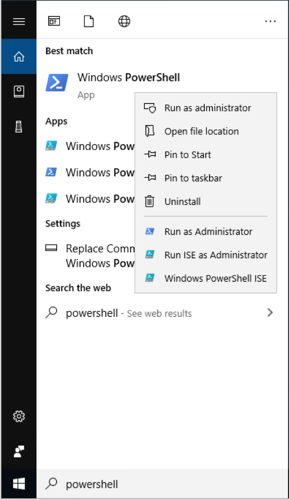
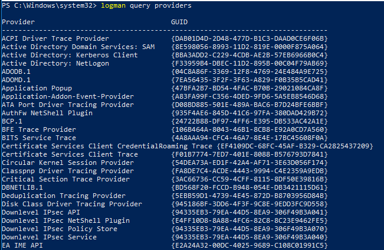
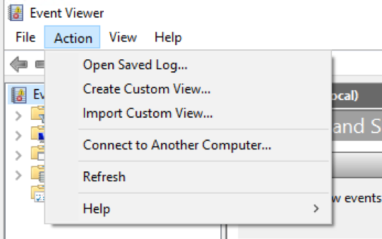

+++
title = "Engineer a Detection - Logman ETW"
menuTitle = "Engineer a Detection - Logman ETW"
chapter = false
weight = 2
pre = "<i class='fab fa-leanpub'></i> "
+++

---
## Goals

* Understand Event Tracing for Windows.
* Identify Running Traces Sessions and query ETW Providers.
* Use Powershell and Logman to generate and events for consumption.

__Scenario__

In a previous lab we discovered that New-Service leverages RPC as part of the service creation routine. Until now we have relied on [Microsoft's Service Control Manager Remote Protocol documentation](https://docs.microsoft.com/en-us/openspecs/windows_protocols/ms-scmr/705b624a-13de-43cc-b8a2-99573da3635f) to make inferences about the implementation details for New-Service's RPC interactions. Inferences are a good start, but we generally like to confirm these details through dynamic or static analysis. As a lead in to this lab, we introduced the idea of Event Tracing for Windows or ETW. This is a logging feature that is available by default on all modern versions of Windows which provides a mechanism for monitoring numerous aspects of the operating system. You are likely very familiar with at least one technology that is the result of ETW, the Windows Security Event Log. The cool thing is that ETW already feeds the Windows Security Event Log, but it also has numerous other events that remain dormant until specifically asked for.

This lab will take you on a tour of one way to explore ETW natively, explain ETW concepts as they become relevant, and show how you can enable targetted logging for testing and validation all within the context of sc.exe and PowerShell's New-Service.

___
### Requirements
- Windows 10 VM

## Steps

### Step 1: Query ETW sessions and providers with "logman"

*  Click on the Windows Start Menu

*  In the search bar, type "powershell"

*  Right click on "Windows PowerShell" and select "Run as Administrator"



To start, we want to take a look at all of the running trace sessions:

**Note:** Event tracing sessions record events from [ETW Providers](https://docs.microsoft.com/en-us/windows/win32/etw/about-event-tracing#providers). These sessions are enabled by a [controller](https://docs.microsoft.com/en-us/windows/win32/etw/about-event-tracing#controllers), that is an application in charge of enabling/disabling providers, specifying the log file the tracing sessions are written to, and starting/stopping the event tracing sessions. Controllers can also update and query tracing sessions.

```
logman query -ets
```


Notice that there are already a few trace sessions running on the system by default. As mentioned earlier in the lab, the trace session where the "Data Collector Set" is set to EventLog-System is the trace session that is collecting on behalf of the Windows System Event Log.

Let's take a look to see the specific provider that the `EventLog-System` trace is subscribed to:

**Note:** Event Providers are similar to subjects in ETW logging. They are applications that contain the type of events you would like to create tracing sessions for. For example - the  `Microsoft-Windows-RPC` provider will log events that correlate with different RPC activity.
    
```
logman query "EventLog-System" -ets
```


Make note of the `File-Mode` field at the top of the output and `Name` & `Provider GUID` fields for each subsection. 

Now let's take a look at all of the providers availible:
```
logman query providers
```


Because we want to filter on all of the possible providers, let's store the providers into a variable with this command:

```
$ETW = logman query providers
```

**Note:** This command can take a long time to finish.

To view all of the providers related to RPC run the following command:
```
$ETW | Where-Object { $_ -Like “*RPC*”}
```


### Step 2: Execute a new service creation and collect the data using logman

**Note:** For this next step, we want to open up a second powershell. We will refer to this as `Powershell #2` for the rest of this lab and the first powershell window as `Powershell #1`.

*  Click on the Windows Start Menu

*  In the search bar, type "powershell"

*  Right click on "Powershell" and select "Run as Administrator".

*  In `Powershell #1` start an event tracing session by typing: 
   
```
logman start RPCTrace -p Microsoft-Windows-RPC 0xffffffffffffffff win:Informational -ets
```

{}

Breaking down the above command: 


`logman start RPCTrace` is going to start an event tracing session with the name "RPCTrace". 


`-p Microsoft-Windows-RPC` will specify the provider "Microsoft-Windows-RPC".


 `0xffffffffffffffff` is specifying to capture all RPC Keywords. Keywords are used to classify different types of events.


 `win:Informational` is specifying we want to collect informational events.


 `-ets` sends the commands to the Event Tracing Session directly versus saving or scheduling.


{}

* In `Powershell #2` create a new service by typing the following command:

```
New-Service -Name "Test_Service" -BinaryPathName C:\Windows\System32\calc.exe
```

*  In `Powershell #1` stop the tracing session

```
logman stop RPCTrace -ets
```

### Step 3: Change the ETL file to EVTX and import into the Event Log

*  In `Powershell #1` output the ETL file to EVTX

```
tracerpt RPCTrace.etl -o RPCTrace.evtx -of EVTX
```

*  In the Start Menu type "Event Viewer"

*  Click on "Event Viewer"

*  In the top left under "Action" click on "Open Saved Log..."



*  Go to the path you saved the RPCTrace.evtx file and open it.

**Note:** If you didn't change your path when you opened up powershell the path will be - `C:\Windows\System32\RPCTrace.evtx`.

*  Click "Ok"

**Note:** RPCTrace will now be under `Saved Logs` within the Event Viewer.


### Step 4: Analyze the RPC logs

*  In the Event Viewer on the right, click on "Find..."
*  Type in this UUID: `367ABB81-9844-35F1-AD32-98F038001003` and press "Find Next".


**Note:** The two RPC UUID's that correlate with Service Creation are: `367ABB81-9844-35F1-AD32-98F038001003` and `338CD001-2244-31F1-AAAA-900038001003`. Read more about the [Service Control Manager Remote Protocol](https://docs.microsoft.com/en-us/openspecs/windows_protocols/ms-scmr/705b624a-13de-43cc-b8a2-99573da3635f).

---
## Conclusion:

This lab was meant to provide a better insight into ETW events and how they can be used to look for RPC events within a host. Unforunately right now, there is no way to provde ETW level context at scale within an organization. However, there are other ways we can capture this type of information. Zeek logs over the network is one, they have a `DCE_RPC` log that will show when RPC is performed over the network.